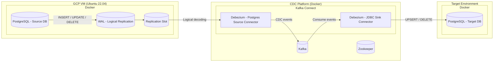

# PostgreSQL CDC with Debezium & Kafka

This repository helps you reproduce a Change Data Capture (CDC) setup using PostgreSQL, Kafka, and Debezium.

## Architecture



## Prerequisites

- Docker and Docker Compose installed.

## Quick Start

### 1. Start the Stack

Run the following command to start all services (Source DB, Target DB, Kafka, Zookeeper, Debezium, Portainer):

```bash
docker compose up -d
```

> **Note:** The `pgsource` container is pre-configured with `wal_level=logical` via the docker command, so you don't need to manually edit `postgresql.conf`!

### 2. Prepare Source Database

Log into the source database container:

```bash
docker exec -it pgsource bash
```

Run `psql`:

```bash
psql -U postgres
```

Inside `psql`, run the following SQL commands to create the CDC user, database, and permission:

```sql
-- Create CDC user
CREATE ROLE cdc_user WITH LOGIN PASSWORD 'cdcpass';
ALTER ROLE cdc_user REPLICATION;
GRANT CONNECT ON DATABASE postgres TO cdc_user;

-- Create Demo Database and Switch to it
CREATE DATABASE cdc_demo;
\c cdc_demo;

-- Create Table
CREATE TABLE orders (
  id SERIAL PRIMARY KEY,
  customer_name TEXT,
  amount NUMERIC,
  status TEXT,
  created_at TIMESTAMP DEFAULT now()
);

-- Insert Initial Data
INSERT INTO orders (customer_name, amount, status) VALUES ('Alice', 100, 'NEW');

-- Enable Publication
CREATE PUBLICATION cdc_pub FOR ALL TABLES;

-- Give ownership to cdc_user (Debezium needs this to see changes seamlessly)
ALTER TABLE public.orders OWNER to cdc_user;
```

Exit `psql` (`\q`) and the container (`exit`).

### 3. Register Debezium Source Connector

Register the PostgreSQL source connector using the provided JSON config:

```bash
curl -i -X POST -H "Accept:application/json" -H "Content-Type:application/json" \
  http://localhost:8083/connectors/ \
  -d @connector-source.json
```

Check status:
```bash
curl -H "Accept:application/json" http://localhost:8083/connectors/pg-cdc-source/status
```

### 4. Prepare Target Database (Optional but Recommended)

Although the Sink Connector is configured to `auto.create` tables, creating the table manually ensures types are exactly as expected.

```bash
docker exec -it pgtarget psql -U postgres -c "CREATE TABLE orders (id SERIAL PRIMARY KEY, customer_name TEXT, amount NUMERIC, status TEXT, created_at TIMESTAMP DEFAULT now());"
```

### 5. Register JDBC Sink Connector

Register the sink connector to replicate data to the target Postgres:

```bash
curl -i -X POST -H "Accept:application/json" -H "Content-Type:application/json" \
  http://localhost:8083/connectors/ \
  -d @connector-sink.json
```

Check status:
```bash
curl -H "Accept:application/json" http://localhost:8083/connectors/pg-sink/status
```

## Verify Replication

1. **Insert data into Source**:
   ```bash
   docker exec -it pgsource psql -U postgres -d cdc_demo -c "INSERT INTO orders (customer_name, amount, status) VALUES ('Bob', 250, 'PAID');"
   ```

2. **Check Target**:
   ```bash
   docker exec -it pgtarget psql -U postgres -c "SELECT * FROM orders;"
   ```

You should see 'Bob' in the target database!

## Troubleshooting

- **Check Logs**: `docker compose logs -f connect` to see Debezium logs.
- **Portainer**: Open `http://localhost:9000` to inspect containers visually.
